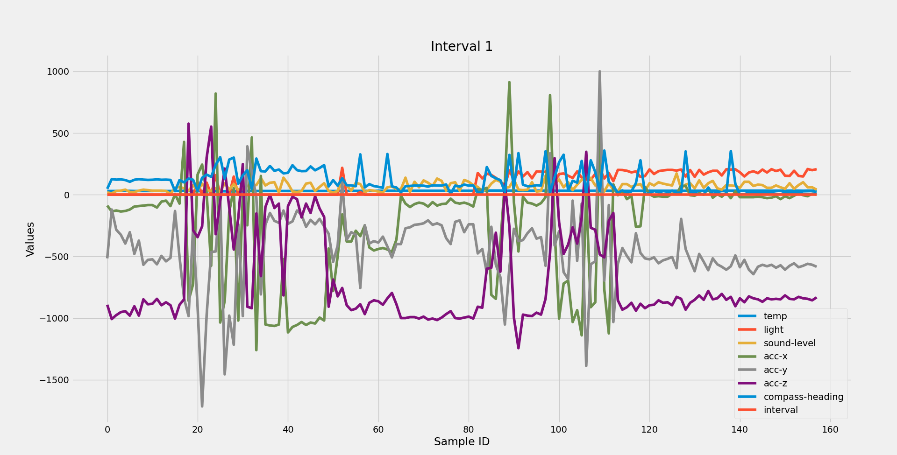
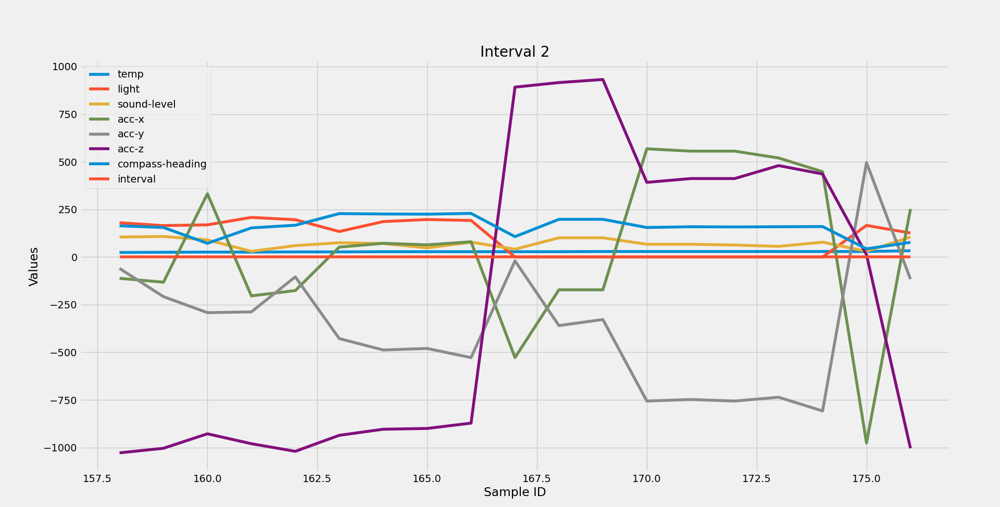
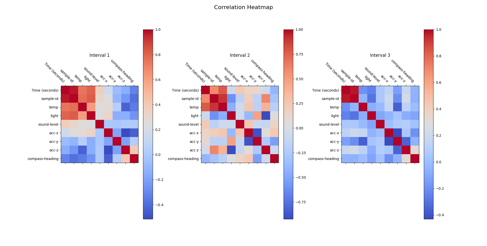

# analisis_dades_microbit
Data analysis of Micro:bit with maplotlib, numpy and pandas

# Table of Contents
- [All data](#all-data)
- [Temperature](#temperature)
- [Light](#light)
- [Sound](#sound)
- [Acceleration](#acceleration)
- [Compass Heading](#compass-heading)
- [Correlation Heatmap](#correlation-heatmap)

---

# All data
### Interval 1

### Interval 2

### Interval 3

# Temperature
In this chart I decided to make a scatter graph with the 3 intervals on the same graph to see the differences between the intervals better.

# Light
This barh chart compares the number of times the microbit stored a low or high luminosity measured in lux. If the value is below 150 is considered dark and if it's above 150 is considered light.

# Sound
This histogram compares the level of sound measured in dB between the 3 intervals. The threshold is set at 70db which is considered disturbing. Also shows the mean of that interval.

# Acceleration
This plot chart compares the 3 acceleration axis (X, Y and Z) between the 3 intervals and points at the maximun and minimun values of each axis.

# Compass Heading
This pie chart compares the percentage of times the microbit has pointed in which direction between the 3 intervals.

# Correlation Heatmap
This graph shows the correlation heatmap between each field in each interval.

